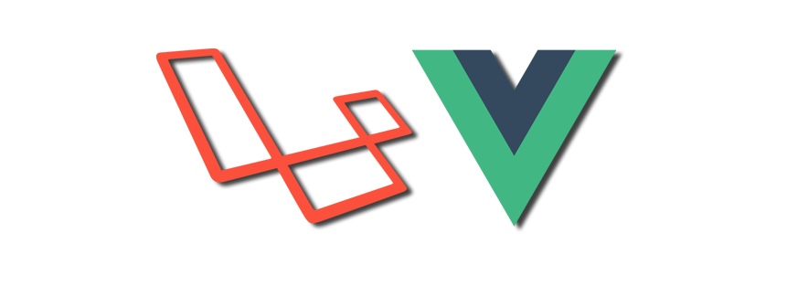

<p align="center"><a href="https://laravel.com" target="_blank"></a></p>

## About Laravel

Laravel is a web application framework with expressive, elegant syntax. We believe development must be an enjoyable and creative experience to be truly fulfilling. Laravel takes the pain out of development by easing common tasks used in many web projects, such as:

## About Vue
Vue (pronounced /vjuː/, like view) is a JavaScript framework for building user interfaces. It builds on top of standard HTML, CSS, and JavaScript and provides a declarative, component-based programming model that helps you efficiently develop user interfaces of any complexity.

## Contributing
```bash
# Clone the repository
git clone https://github.com/wei-sys/laravel-vue.git

# Navigate to the cloned directory
cd laravel-vue

# Install the dependencies
composer install

# Create a database
php artisan migrate

# Install the dependencies
npm i

# build the frontend
npm run build

# http://localhost/admin/#/dashboard
```